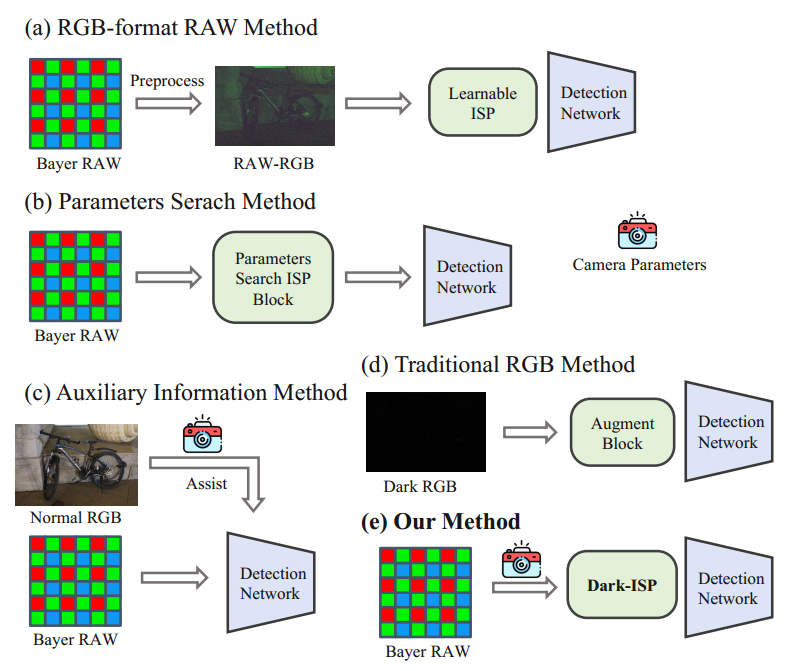
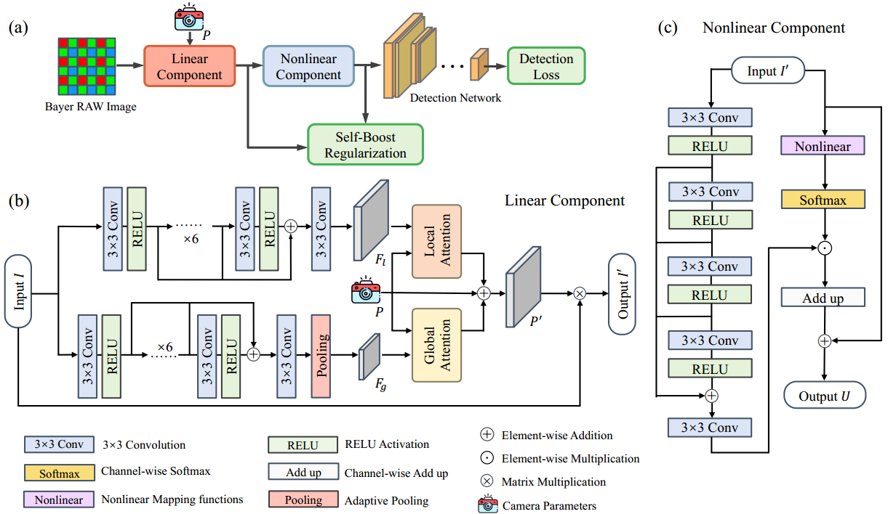
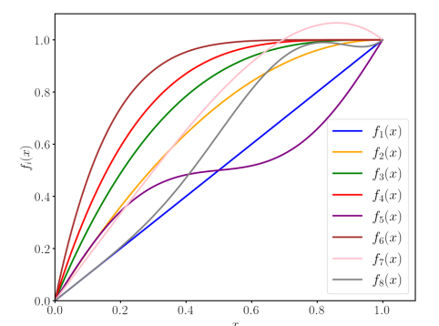

#### 告别黑暗中的“盲视”：Dark-ISP让RAW图像在微光检测中大放异彩

本文认为，Bayer RAW图像保留了丰富的光子信息和动态变化，因此作者直接利用RAW传感器数据进行端到端的弱光目标检测。

<!-- more -->

#### 背景：

在伸手不见五指的夜晚，自动驾驶汽车和安防摄像头如何才能像白天一样“看”清世界？低光环境下的目标检测一直是计算机视觉领域的棘手难题，黑暗会导致严重的图像退化，使得图像噪声放大和对比度降低。

- 传统方法通常先进行弱光图像增强，再进行检测，但是**图像增强/恢复方法是针对人类视觉感知进行优化的，不一定有利于机器视觉理解任务，甚至可能丢失关键信息或引入噪声。**

- **RAW图像由于保留了丰富的细节和光照信息**，RAW在**记录极暗和极亮的区域时，有更高的精度和更细腻的层次**，对于弱光检测，暗部区域的这点“残存”信息可能至关重要。此外，RAW格式文件还**存储了摄影过程中的相机元数据，可以作为辅助信息，为深度网络训练提供额外的指导。**

- **RAW数据更接近物理真实**，RAW数据与光子数成线性关系。让模型直接学习这种未被“扭曲”的原始物理信号，可能更容易让它学到光照不变的本质特征。

- 但现有方法在处理弱光图像时，通常会走一条“捷径”：**先把信息丰富但难以直接使用的RAW数据，通过一个为人类视觉优化的、充满信息损失的流程，转换成标准的人眼看着舒服的RGB图像**，但是这个过程**为了压缩动态范围、去噪和调整色彩，会丢弃大量对目标检测有用的原始信息，尤其是在亮度极低的区域。**

- 或者**采用复杂的框架，难以与检测任务端到端联合优化。**

  

- 现有的方法主要分为三类：

- 图a，将**四通道Bayer RAW图像绑定并量化为三通道RAW-RGB**，以确保能够**兼容**预训练backbone。但是这种转换**降低了位深度并导致大量信息丢失**。没有利用好RAW的优势。
  - 降低位深度指的是**在图像处理或转换过程中，用来表示每个像素颜色信息的二进制位数减少了，导致图像的色彩精度下降**。
  - “降低位深度”这个动作，就相当于：你本来用那个拥有4096种颜色的专业颜料盒画了一幅色彩过渡极其细腻的画（RAW图像），现在要把这幅画用那个只有256种颜色的学生颜料盒重新临摹一遍（转换为JPEG图像）。对于原来4096种颜色中的大部分，你都得在现有的256种颜色里找一个“最接近的”来替代。
  - 这样做会导致**色彩断层 (Banding)**，原本非常平滑的颜色渐变（比如黄昏时的天空），因为缺少了中间的过渡色，会变成一圈一圈的色块，出现明显的断层。**细节丢失**，在非常暗或非常亮的区域，原本存在的细微亮度差别会因为被合并成同一种颜色而消失。
- 图b，使用**可训练的ISP模块直接处理Bayer RAW图像**以桥接RAW和RGB域。虽然有效，但这些方法**涉及复杂的参数搜索算法和多阶段训练策略，计算量巨大，难以部署到现实世界。**
- 图c，**依赖于辅助信息增强**，在训练过程中会整合正常光照下的RGB图像或相机元数据作为参考信息。然而，**这些额外数据不仅在现实中难以获取，而且从模型设计的角度来看，一个先进的算法本来就不应该强制要求这些数据才能工作。**

本文的核心思想就是：**不要让为人类视觉设计的ISP成为机器视觉的瓶颈**。

- 提出了一个**轻量级、自适应、可微分（可学习）**的图像信号处理（ISP）插件**Dark-ISP**。
- 放弃了先将RAW图像转为有信息损失的RGB图像再检测的传统路径，而是能够**直接处理最原始的Bayer RAW数据，并以最终的检测效果为优化目标，生成最有利于后续检测网络识别目标的图像，进行端到端的处理和优化。**
- **将RAW到RGB的转换过程变得智能且自适应，从而打造出一个专为下游目标检测任务服务的、高效的图像处理流水线，在弱光环境下取得了顶尖的检测性能 。**

#### 本文的主要创新是：

（1）巧妙地将复杂的ISP过程解构成两个关键部分：

- **串行线性子模块（传感器校准，**即该模块主要负责**处理相机传感器基础颜色校准相关的操作**，例如白平衡、颜色校正等，这些在数学上通常是一系列的**线性的矩阵变换**）和**非线性子模块（色调映射**，即该模块主要负责**处理色调映射、明暗对比**，调整图像的亮度、对比度和色彩分布，这通常是一个**非线性的曲线调整过程**）

- 将它们**重新构建为可以通过任务驱动的损失函数进行优化的可微分组件**（可微分组件是指这个模块可以用深度学习的方法（特别是**反向传播算法）进行训练和优化**。这是让传统算法能够“学习”的关键）。
- 每个模块都具备
  - **内容感知的自适应性**（指模块的**处理方式不是一成不变的**，而是可以**根据输入图像的具体内容**（例如亮度、纹理、物体）**动态地进行调整**）
  - 和**物理信息先验**（指在设计模块时，**融入了现实世界中的物理规律作为先验知识**（例如，相机传感器的噪声模型、光学成像原理等），**而不是让网络凭空学习一切**。这让模型学习得更快、效果更好。），
  - 从而能够**实现与检测目标一致的、自动化的RAW到RGB转换**。

（2）通过利用ISP方法固有的**级联结构**（处理流程是**一系列连续的步骤**，前一步的输出是后一步的输入，线性模块处理完，再交给非线性模块处理），作者设计了一种**自我提升机制**，让**级联结构中的前后两个模块能够互相“沟通”和“对齐”目标**，使得**它们的优化方向一致**，从而更好地协作，达到1+1>2的效果。

#### 过程：

1. **动态线性映射 (Dynamic Linear Mapping)**
   - 传统ISP中的白平衡、颜色空间转换等操作本质上都可以简化为一系列矩阵乘法 。**这篇文章首先将这些操作统一成一个初始的线性变换矩阵P （线性模块）。**
   - 但是**它认为这个变换矩阵不应该是固定不变的**，而应该根据图像内容**动态调整（内容感知的自适应性）**。因此，**通过一个双流网络提取图像的局部和全局特征，再利用局部-全局注意力机制（Attention）生成动态的、逐像素的变换矩阵 P'**，使其能够**自适应地处理不同光照和内容的图像** 。
2. **多项式基的非线性延展 (Nonlinear Stretch with Polynomial Bases)**
   - 经过线性校正后，需要**进行类似色调映射（Tone Mapping）的非线性操作来调整图像的明暗分布**。
   - **不同于使用一个“黑箱”的神经网络来学习这个变换，**作者基于一个**物理先验：**处理弱光图像需要“**拉伸暗部，压缩亮部**” 。为此，他们预先设计了一组（8个）具有这种非凸特性的多项式函数（称为基函数） 。网络要学习的**不再是一个复杂的映射，而是每个像素点应该如何“混合”这些基函数，即学习它们的组合系数 。**这种方法物理解释性强，也更稳定 。
3. **自增强正则化 (Self-Boost Regularization)**
   -  这是一个非常巧妙的设计。它基于一个假设：**更深层网络（非线性模块）的输出U比浅层网络（线性模块）的输出I'更接近最终的理想目标** 。因此，它**将U作为一个“伪目标”，反过来指导线性模块的学习** 。具体来说，它计算出一个**理想的线性矩阵。P̃(从I直接到U的近似解)** ，然后**通过一个损失函数 $$L_{sb}$$促使线性模块生成的实际矩阵P'与这个理想矩阵 P̃ 的方向保持一致** 。这就像一个“老师”（深层模块）在不断地给“学生”（浅层模块）指明正确的学习方向。
   -  **使用非线性模块的输出来指导线性模块的学习。**

---------------------------------------------------------------------------------------

#### 这里的多项式基的非线性延展有点没看懂：

1. **关于“黑箱的神经网络”**

   传统的神经网络是使用一个结构复杂的网络（比如U-Net），输入一张处理前的图像，期望它输出一张处理后的图像。**网络内部成千上万的参数会通过反向传播进行调整，最终学习到一个能最小化损失函数（优化目标）的输入-输出映射。**我们知道这个映射**有效**，但无法轻易地用简洁的数学或物理语言来描述这个映射**是什么**，它**内部的变换过程是高度复杂和非直观的，因此称之为“黑箱”。**而本文不使用这种不可解释的黑箱方法，它将变换的形式（基底）先限定在一个特定、且有物理解释的函数集合里，让网络只学习如何组合它们。

2. **这个物理先验**

   “处理弱光图像需要‘拉伸暗部，压缩亮部’”，主要来源于两个领域：数字图像处理中的“色调映射（Tone Mapping）”理论和对人类视觉系统的模拟。

   - **高动态范围（HDR）成像**：**相机传感器能捕捉到的亮度范围（动态范围）远超普通显示器能显示的范围。**为了在低动态范围的屏幕上显示高动态范围的图像，必须进行“色调映射”。一个最关键的操作就是**非线性地**压缩亮度。**为了保留暗部的细节，必须将暗光区域的亮度级差“拉伸”开；而为了防止亮部“过曝”变成一片纯白，则必须将亮光区域的亮度级差“压缩”起来。**
   - **人类视觉系统**：人眼在适应不同光照环境时，其反应本身就是非线性的。在黑暗环境中，人眼对微弱的光线变化更敏感（等同于拉伸暗部），而在非常亮的环境中，对强光的变化则不那么敏感（等同于压缩亮部）。

   因此，这个先验知识是数字成像领域为了在有限的显示设备上更好地还原和增强图像细节，并参考了人眼工作原理而总结出的黄金法则。论文中也明确指出，**这种非凸映射（non-convex mappings）是必需的，目的是“增强阴影细节并防止亮区过曝” 。**

3. **“将暗光区域的亮度级差拉伸开”，“将亮光区域的亮度级差压缩起来” ？**

   不是简单地将暗部“调亮”或者将亮部“调暗”，而是**重新分配显示屏有限的亮度级别**，目的是在有限的范围内呈现出尽可能丰富的细节。

   假设**相机传感器**能记录的亮度范围是 **0 到 4095** (这是一个12位RAW图像的常见范围，共4096个级别)。而我们**手机屏幕**能显示的亮度范围是 **0 到 255** (这是一个标准的8位图像范围，共256个级别)。那么我们就需要把传感器捕捉到的4096个级别，塞进屏幕的256个级别里。

   - “将暗光区域的亮度级差拉伸开”，假设一张夜景照片，大部分细节都集中在很暗的区域，比如传感器记录的 **[0, 500]** 这个亮度区间内。这里面包含了汽车的轮廓、行人的影子等重要信息。
     - **如果不做任何处理（线性压缩）**：[0, 500] 这个范围会被等比例地映射到屏幕的 [0, 31] 这个范围。传感器的500个级别被挤在屏幕的31个级别里，亮度值5和亮度值20在屏幕上可能看起来都是一片漆黑，人眼根本分不出区别。**细节丢失了**。
     - **“拉伸”操作**：为了看清暗部细节，我们决定把屏幕上更多的亮度级别**分配**给这个区域。比如，我们把屏幕的 **[0, 100]** 这100个级别，专门用来显示传感器记录的 **[0, 500]** 这个范围。
     - 现在，传感器的500个级别被“拉伸”到了屏幕的100个级别上。**原本亮度为5和20的两个点，现在可能被映射到屏幕亮度10和40，区别一下子就变得非常明显。**
     - 暗部整体变亮了，**而且暗部区域内的对比度大大增强，原本看不清的细节现在清晰可见。**这就是“拉伸亮度级差”的含义。
   - 这里的拉伸就是**将传感器的很小一段亮度范围，映射到输出屏幕的很大一段范围上。**
   - “将亮光区域的亮度级差压缩起来”，如果把大部分屏幕亮度级别（0到100）都用在暗部了，留给亮部的级别就不多了。假设照片中的亮部（比如路灯）的亮度范围在传感器的 **[3000, 4095]** 这个区间，这是一个长达1096个级别的范围。
     - **“压缩”操作**：由于留给我们的屏幕亮度级别只剩下 **[240, 255]** 这最后15个级别了，我们**只能把传感器记录的[3000, 4095]这1096个级别，全部“硬塞”进屏幕的[240, 255]这15个级别里。**
     - 传感器上**亮度为3200和3800的两个点，可能在屏幕上都被显示为亮度252**，人眼已经无法区分它们的差别。**亮部区域内的对比度急剧下降。**
     - 这**不是把亮部调暗**（亮度3800的点依然被显示为非常亮的252，而不是变暗），而是**牺牲了亮部区域的细节和层次感**。这么做的主要目的是**防止过曝**——即**防止所有高于3000的亮度点全都变成屏幕上纯白的255，那会导致路灯的灯芯和光晕细节全部丢失。我们保留了它们“都很亮”这个信息，但放弃了它们“具体有多亮”的区别。**
   - 压缩就是**传感器的很大一段亮度范围，被挤压到了输出屏幕的很小一段范围上。**

   总结：就是为了让夜景照片更好看，把**大部分级别花在最重要的“暗部细节”上（拉伸）**。而**只留一小部分级别给次要的“亮部层次”（压缩），只要保证它别过曝就行。**

4. **每个像素点应该如何“混合”这些基函数，即学习它们的组合系数 。**

   - 类似于一个ax+by+cz。
   - x、y、z分别是空间中的三个基底，对应于文中说的**预先设计好的、固定不变的多项式基函数$$ \left\{ f _ { k } ( x ) \right\}$$。**
   - 然后我要学习abc这三个组合系数，对应于文中由神经网络**为每个像素动态学习**出来的**组合系数**$$ \left\{ C _ { k } ( i , j ) \right\}$$。通过这三个基底构造得到一个空间非线性的曲线来进行色调映射进而得到映射结果。文中就是得到最终变换函数$$ F ( x _ { i j } ) = \sum _ { k = 0 } ^ { n } C _ { k } ( i , j ) f _ { k } ( x _ { i j } ) 。$$
   - 所以，整个过程就是，**对于图像中的每一个像素（i，j），网络都会输出一组系数（比如a,b,c,...），然后用这组系数去加权混合那一套固定的基函数（x,y,z,...），为这个像素学习出一条最优的色调映射曲线，**将这个像素原来的亮度代入曲线，得到新的映射后的亮度。

这样网络**不再是一个复杂的黑箱映射**，不需要从一个几乎无限的函数空间中，大海捞针般地去寻找一个能拟合数据的最优函数。网络不再需要学习“映射本身是什么”，映射的**基本形态已经被作者通过预设的8个基函数给限定好了。**网络的任务被大大简化，只需要学习一个更简单的问题：“**针对当前这个像素点，我应该用哪个基函数多一点，用哪个少一点？**”。它学习的是**组合方式**，而不是**变换本身** 。

#### 模型：

#### 动态线性映射（Dynamic Linear Mapping）：

调整颜色平衡，将Bayer图像$$ I \in R ^ { 4 \times H \times W }$$转换为RGB，使用矩阵变换将RAW传感器数据映射到感知均匀的颜色空间。

首先，白平衡操作通过**对角增益矩阵$$ W \in R ^{4 \times 4 }$$来对RAW数据补偿光源变化：**

$$ \begin{pmatrix} r ^ { \prime } \\ g ^ { \prime } _ { r } \\ b ^ { \prime } \\ g ^ { \prime } _ { b } \end{pmatrix} = \begin{pmatrix} w _ { 1 } \quad 0 \quad 0 \quad 0 \\ 0 \quad w _ { 2 } \quad 0 \quad 0 \\ 0 \quad 0 \quad w _ { 3 } \quad 0 \\ 0 \quad 0 \quad 0 \quad w _ { 4 } \end{pmatrix} . \begin{pmatrix} r \\ g _ { r } \\ b \\ g _ { b }\end{pmatrix} .$$

然后接下来，通过Binning操作将四个Bayer通道合并为三个RGB通道，**使用稀疏矩阵$$ B \in R ^ { 3 \times 4 }$$对两个绿色通道取平均值，从而将它们合并成一个单独的绿色通道，最终得到标准的红（Red）、绿（Green）、蓝（Blue）三个通道。**

$$ \begin{pmatrix} R \\ C \\ B \end{pmatrix} = \begin{pmatrix} 1 & 0 & 0 & 0 \\ 0 & \frac { 1 } { 2 } & 0 & \frac { 1 } { 2 } \\ 0 & 0 & 1 & 0 \end{pmatrix} . \begin{pmatrix} r ^ { \prime } \\ g ^ { \prime } _ { r } \\ b ^ { \prime } \\ g ^ { \prime } _ { b } \end{pmatrix} .$$

然后，进行颜色空间变换，**使用颜色校准矩阵$$ C \in R ^ { 3 \times 3 }$$将图像映射到感知颜色空间：**

$$ \begin{pmatrix} R ^ { \prime } \\ G ^ { \prime } \\ B ^ { \prime } \end{pmatrix} = \begin{pmatrix} c _ { 1 1 } \quad c _ { 1 2 } \quad c _ { 1 3 } \\ c _ { 2 1 } \quad c _ { 2 2 } \quad c _ { 2 3 } \\ c _ { 3 1 } \quad c _ { 3 2 } \quad c _ { 3 3 } \end{pmatrix} . \begin{pmatrix} R \\ G\\B \end{pmatrix} .$$

整个过程可以整体概括为**通过一个矩阵$$ P \in R ^ { 3 \times 4 }$$将RAW图像$$ I$$转换为校正后的RGB图像$$ I ^ { \prime } \in R ^ { 3 \times H \times W }$$**

$$ I ' = C \cdot B \cdot W \cdot I = P \cdot I .$$

**白平衡系数和色彩校正矩阵（CCM）通常是由相机内置的自动白平衡算法，或是通过对标准色卡进行手动回归估算来确定的**。由于这些参数是每台相机特有的，它们在图像处理方法中基本保持不变。**为了改善图像、下游任务以及这些参数之间的交互，作者将它们视为学习过程的一部分。**

为了**增强在不同传感器和弱光条件下的适应性，作者引入了动态映射。**RAW图像$$ I$$首先**通过一个双流架构进行处理，以提取像素级的局部特征$$ F _ { l } \in R ^{C\times H \times W}$$和图像级的全局特征$$ F _ { g } \in R ^ { C \times \frac { H } { 1 6 } \times \frac { W } { 1 6 } } 。$$然后通过局部和全局的注意力机制，来生成像素级和图像集的操作：**

$$ P _ { l } = L o c a l A t t n ( Q = F _ { l } , K = P , V = P ) \in R ^ { ( 3 \times 4 ) \times H \times W }$$

$$ P _ { g } = G l o b a l Attn ( Q = P , K = F _ { g } , V = F _ { g } ) \in R ^ { 3 \times 4 } .$$

- 像素级的操作，指为图像中的**每一个像素点都生成一个专属的、不同的处理参数**。它是**由前面提取的“像素级的局部特征$$ F ^{"}_ { l } $$生成**的。**因为$$ F _ { l }$$保留了原始图像的空间维度（H x W），它包含了每个像素邻域的局部信息。利用这些局部信息，注意力机制可以计算出一个维度为 (3×4×H×W) 的变换矩阵**。这意味着，**对于(H, W)个像素中的每一个，都有一个独立的 3×4 矩阵来对它进行操作。这允许模型进行非常精细的、针对每个像素的局部调整。**
- 图像级的操作，指生成一个**统一的**处理参数，并将其**应用到整张图像的所有像素**上。它是**由“图像级的全局特征$$ F^{ "} _ { g }$$”生成**的。**因为$$ F _ { g }$$的空间维度被大大缩小，它丢弃了局部细节，代表了整张图像的宏观、全局信息（例如，这张图整体有多暗，整体是什么色调）。利用这个全局信息，注意力机制计算出一个维度为 (3×4) 的变换矩阵。这个单一的矩阵会被应用到图像中的每一个像素上，实现对整个图像的统一调整。**
- 一个基于**全局**信息的“统一滤镜”（图像级操作），负责对整个画面的共性问题进行调整。
- 一个基于**局部**信息的“精细画笔”（像素级操作），负责对画面中每个小区域的个性化问题进行微调。
- 将这两种操作结合起来，模型就获得了极强的自适应性.

随后，**局部操作与全局操作通过算术求和（广播机制）并结合一个跳跃连接，从而生成自适应线性变换** :

$$ P ^ { \prime } = ( P _ { l } + P _ { g } + P ) \in { } ^ { 3 \times 4 \times H \times W }$$

这些参数被应用于RAW图像，以产生校正后的RGB输出：

$$ I ^ { \prime } = ( P _ { l } + P _ { g } + P ) \cdot I = P ^ { \prime } \cdot I .$$

这一过程由摄影原理和特定任务的反馈驱动，实现了灵活的内容感知转换，提高了弱光条件下的性能，特别是目标检测。

#### 具有多项式基的非线性拉伸

**明确设计物理可解释的函数库，以确保所需的属性，并自适应地组合它们以实现图像特定的增强。**

对于线性模块生成的**每个图像$$ I ^ { \prime }$$，网络预测像素系数$$ \left\{ C _ { k } \right\} _ { k = 0 } ^ { n }$$。然后通过这些系数组合一组多项式基$$ \left\{ f _ { k } ( x ) \right\} _ { k = 0 } ^ { n }$$形成非线性变换：**

$$ F ( x _ { i j } ) = \sum _ { k = 0 } ^ { n } C _ { k } ( i , j ) f _ { k } ( x _ { i j } ) .$$

这里，$$ ( i , j )$$表示像素位置。**这种变换可以逼近一个复杂的具有高阶无穷小误差$$ o ( x ^ { n } )$$的局部平滑函数$$ H ( \cdot )$$：**

$$ H ( x ) = F ( x ) + o ( x ^ { n } ) = \sum _ { k = 0 } ^ { n } C _ { k } ( i , j ) f _ { k } ( x ) + o ( x ^ { n } ) .$$

这个方法构建出的最终函数，**是由许多个预先定义好的基础函数组合而成的。而这些基础函数本身又是由更简单的数学项（如常数项、$$ x$$项、$$ x ^ { 2 }$$项等）构成的。**

**这类似于n阶泰勒展开**，将这个复杂的组合展开后，把所有相同类型的项进行重新归类。例如，把所有常数项都归到一堆，所有与$$ x$$相关的项归到另一堆，所有与$$ x ^ { 2 }$$相关的项再归一堆，以此类推。完成归类后，每一堆（比如所有与$$ x $$相关的项）的最终系数，是由原来所有属于这一堆的项的系数通过计算合并成的一个总系数。

为了设计出能主导非线性变换的基函数，作者专注于解决弱光图像的特性问题。**使用非凸映射来拉伸暗部区域、同时压缩明亮区域。这种调整能够增强阴影细节并防止亮区过曝**，可以显著提升视觉质量，为此，作者设计了一组**非凸基函数**，其中$$ f _ { 0 } = 1$$，并且**每个$$ f _ { k } ( x )$$都是一个通过（0,0）点和（1,1）点的k阶多项式**。这些多项式能够**捕捉从近线性到凹形的各种曲率模式**，从而**有效地处理弱光场景下的亮度重新分布问题。**

这样，多项式基函数的集合形成了有效色调映射操作$$ F ( \cdot )$$的低维流形。

- 有效色调映射操作的所有可能性是一个**无限大、高维度**的空间，想象一下，所有能将输入亮度（0到1）映射到输出亮度（0到1）的曲线（色调映射函数）有多少种？答案是**无限多种**。你可以画出任何形状的曲线，**只要它从(0,0)到(1,1)。这个包含所有可能曲线的“空间”是极其巨大和复杂的，可以理解为一个难以探索的“高维宇宙”**。一个漫无目的的神经网络在这个宇宙里学习，很容易学到一些奇怪、无效或不稳定的曲线。
- 作者没有让网络在无限大的这个“高维宇宙”里自由探索，而是预先设定了8个“基础曲线”（多项式基函数）。所有的“有效操作”**只能是**这8个基础曲线的线性组合。这样一来，所有可能的色调映射曲线就被限定在了一个由这8个基函数“张成”的、非常小的、平滑且有规律的子空间（**低维流形**）里。
- 我们**不去考虑无限多种可能性（高维宇宙）的色调映射曲线，而是通过预先设定一组（8个）表现良好的基础曲线，将所有有效的色调映射操作限定在一个由它们组合而成的、范围很小且性质可控的“有效曲线集合”（低维流形）中**。**极大地降低了学习的难度和不确定性**，确保网络学到的都是“有效”且“稳定”的色调映射方法。

使用$$ F ( · )$$不是一个容易出错的近似；相反，它将非线性函数限制为有限的n维多项式，利用先验知识来平衡表达性和计算效率。**转换后的$$ U = F ( I ^ { \prime } )$$为下游任务提供了增强的图像。**

与其他的同样使用神经网络来生成二次拟合曲线系数的方法不同，本文的方法的不同之处在于**明确考虑弱光特性，防止次优收敛。**具体来说，**使用$$ 3 \times 3$$卷积层来预测像素级系数映射$$ \left\{ C _ { k } \right\} _ { k = 0 } ^ { n }$$，然后通过它来组合多项式基函数（如图（c）所示）。为了防止梯度消失，使用了跳跃连接，并从原始多项式函数中减去x以保持曲线的形状。**

- 在很深的网络中，误差信号（梯度）需要从最后一层一路传回第一层，用来指导每一层参数的调整。在这个过程中，梯度每经过一层，就要乘以该层激活函数的导数。如果这个导数值小于1，那么梯度在逐层向后传递时，就会像滚雪球一样越乘越小，传到最开始的几层时，梯度已经变得极其微弱，近乎于0。这就叫“梯度消失”。**结果就是，靠近输入的底层网络几乎学不到东西**，因为它们接收不到有效的指导信号。

- 跳跃连接（ResNet的核心思想）它将某一层（或某个模块）的输入x，直接加到该模块的输出F(x)上，使得最终输出变为 H(x) = F(x) + x。 在反向传播时，根据求导的链式法则，梯度在回传到x时，会沿着两条路径：

  1. 一条通过模块F(x)，梯度会被乘以F'(x)。
  2. 另一条通过“捷径”x，梯度会**直接加上一个值为1的梯度**（因为x对x的导数是1）。

  这个 +1的操作至关重要。它相当于为梯度提供了一个**畅通无阻的绿色通道**，无论中间模块F(x)内部的梯度变得多小，总有一个保底的梯度1可以被直接传回到底层。**这样就确保了即使网络非常深，底层的参数也能接收到有效的学习信号，从而解决了梯度消失的问题。**

- 假设我们想要的理想变换曲线是H(x)，残差学习方式是我们不让网络直接学H(x)，而是让它学习**目标曲线`H(x)`与输入`x`之间的“差值”或“残差”**，即学习 F(x) = H(x) - x。然后，通过跳跃连接将网络学到的这个残差F(x)加回到输入x上，得到最终结果 F(x) + x = (H(x) - x) + x = H(x)。

- 所以这里的“从原始多项式函数中减去x以保持曲线的形状”，就是指的这个学习**残差**的过程，理想的色调映射曲线H(x)，**可以被看作是一个基础的“恒等变换”（即y=x这条直线）加上一些复杂的“弯曲调整”。** 通过学习残差，我们**将学习任务进行了解耦**：

  - **恒等变换部分（+x）**：由跳跃连接直接得到，网络不需要费力去学。
  - **弯曲调整部分（F(x)）**：这才是网络需要集中精力去学习的**真正有用的非线性“形状”**。

  这样做的好处是，如果最优的变换就是“什么都不做”（即H(x)=x），那么网络只需要学习让`F(x)`输出为0即可，这比学习F(x)去拟合y=x这条直线要容易得多。因此，这种方式让网络更专注于学习**必要的调整形状**，使得训练更稳定、高效。

#### 自提升正则化

给定来自RAW Bayer输入$$ I$$的线性变换图像$$ I ' = P ' \cdot I$$，非线性模块生成增强图像$$ U = F ( I ^ { \prime } )$$。

假如（理想情况下）**我们手上能有这样一张完美的正常光照照片作为标准答案$$ U ^ { * } \in R ^ { 3 \times H \times W }$$，那么我们就能通过最小二乘法的闭式解（closed-form least squares solution），直接计算出将那张黑暗的RAW图转换成这张完美照片的最优的线性映射**：

$$ P ^ { * } = a r g min _ { P ^ { \prime } } | U ^ { * } - P ^ { \prime } \cdot I | | ^ { 2 } = U ^ { * } \cdot I ^ { T } \cdot ( I \cdot I ^ { T } ) ^ { - 1 } ,$$

$$ P ^ { * } \in R ^ { 3 \times 4 }$$，并且所有图像都被重塑为大小为$$ \left[ C \times ( H \times W ) \right]$$的矩阵。然而，这种理想的情况需要配对的RAW-sRGB样本$$ ( I , U ^ { * } ) ,$$，其获取成本非常高。

源于内在特征层级假设：**更深层网络的表示比浅层网络更接近最终目标**，所以作者做了一种相对宽松的策略，通过**用非线性模块自身的输出$$ U$$来代替完美答案$$ U ^ { * }$$，提出了一种自监督的近似方法。**因为$$ U$$是$$P ^ { \prime }$$的函数，所以在用$$ U$$代替$$ U ^ { * }$$时最小二乘法的这个封闭形式解不再成立，但是我们的目标是**促使线性组件的输出$P' \cdot I$与非线性输出$$U$$紧密近似 。因此，将$$U$$视为一个伪目标（pseudo-target）**，定义一个近似的线性映射$\tilde{P}$ ：

$$ \tilde { P } = U \cdot I ^ { T } \cdot ( I \cdot I ^ { T } ) ^ { - 1 }$$

通过该公式，**可以将来自高层级检测损失的梯度更有效地反向传播到线性组件$$ P ^ { \prime }$$**，同时**也为$$U$$在这种正则化和检测损失的对抗过程中提供了更大的优化潜力** 。

---------------------------------------------------------------------------------------

- 为什么能“将梯度更有效地反向传播到线性组件$$ P ^ { \prime }$$？

  - 在没有这个机制的情况下，梯度要从最终的检测损失传递回线性组件，必须依次穿过**检测网络**和**非线性模块**。非线性模块本身是一个比较深的网络结构（图c），**梯度在其中传递时可能会衰减或变得复杂，导致传到最前端的线性组件$P'$时信号已经很微弱。**

  - 作者设计的自我提升损失($$\mathcal{L}_{sb}$$)创造了一条全新的、更短的路径。

    1. 首先，最终的输出$$U$$是由高层级的检测损失$\mathcal{L}_{det}$直接指导优化的。可以说，$$U$$的变化直接反映了检测任务的需求。
    2. 然后，这个公式$$ \tilde { P } = U \cdot I ^ { T } \cdot ( I \cdot I ^ { T } ) ^ { - 1 }$$将U的变化**直接**转换成了对线性组件的一个“期望目标”$$ \tilde { P }$$ 。
    3. 最后，自我提升损失$$\mathcal{L}_{sb}$$直接比较了线性组件当前的参数$$P^{'}$$和这个“期望目标”$$\tilde{P}$$ 。

    这样一来，就相当于在最终输出U和初始的线性组件$P'$之间建立了一个**直接的监督联系**。**高层级任务的信号（体现在$U$上）可以几乎没有衰减地通过这条捷径传递给$$P^{'}$$，指导其进行更有效、更直接的更新 。**

- “为U在这种正则化和检测损失的对抗过程中提供了更大的优化潜力”？

  - 这部分是关于**让U在“左右为难”中找到最优解**。这里的“对抗过程”并不是指GAN网络那种严格的对抗，而是一个更广义的**“博弈”或“平衡”**过程。U的优化目标现在有两个，这两个目标在某种程度上是相互“拉扯”的：
    - 1、**来自检测损失（$\mathcal{L}_{det}$）的压力**：这个损失会驱使U变成**最适合检测网络“看”的图像**。这可能意味着图像的对比度会变得极高，或者某些特征被不自然地夸大，**只要有利于检测就行。**
    - 2、**来自正则化($$\mathcal{L}_{sb}$$)的压力**：这个损失通过把U当作“老师”去指导线性组件P′，反过来也对U提出了要求。为了能成为一个好的“老师”，U本身不能太“离谱”。它必须保持一种**能够被一个线性变换近似**的结构。这相当于一个正则化项，它**约束U不能为了讨好检测器而变得过于扭曲和不真实**，必须与原始的RAW图像I保持一定的线性关联性。

  - **“更大的优化潜力”就来源于此**： 正是因为有了这两个相互制约的目标，**U的优化过程才不会走极端。它不能只顾着提升检测指标，还必须顾及自身的结构合理性**。这种“博弈”迫使U去学习一种**既能显著提升检测效果，又保留了图像内在结构信息的、更鲁棒、更优质的图像表示** 。相比于只有一个单一、无约束的目标，这种有约束、多目标的优化空间显然能引导模型找到一个泛化能力更强的最优解。

---------------------------------------------------------------------------------------

直接让$P'$和$\tilde{P}$对齐是不合适的，因为$\tilde{P}$仅仅是解$P^*$的一个近似，并且两个矩阵在训练过程中都在不断更新。因此，我们不强制严格相等，而是**鼓励$P'$和$\tilde{P}$对应行向量之间的方向一致性** 。我们**将每个矩阵分解为其行向量，$P' = (p'_1, p'_2, p'_3)^T$和$\tilde{P} = (\tilde{p}_1, \tilde{p}_2, \tilde{p}_3)^T$，其中每个向量代表了从四个Bayer通道到单个RGB通道的线性投影 。自我提升损失$\mathcal{L}_{sb}$被定义为这些对应向量对之间余弦距离的总和 ：**

$$ \mathcal{L} _ { s b } = \sum _ {  p _ { i } ^ { \prime } \in P ^ { \prime } , \tilde { p } _ { i } \in \overline { p } } | | 1 - \cos ( p _ { i } ^ { \prime } , \tilde { p } _ { i } ) | | .$$

---------------------------------------------------------------------------------------

我们不能完全信任由U计算出的那个“伪目标”$\tilde{P}$，所以对线性组件$P'$的约束不能太死板。

1. **为什么“直接让$P'和\tilde{P}$对齐是不合适的”？**

作者给出了两个原因：

- **$\tilde{P}$只是个“近似解”，不是标准答案**：我们知道，最完美的“标准答案”是$$P^{∗}$$，但它需要一个我们根本拿不到的完美图像$U^*$才能算出来。现在我们用的$\tilde{P}$是拿$U$（非线性模块的输出）临时替代$U^*$算出来的，**它本身就不是100%准确的目标，只是一个“大概正确的方向”。如果强迫$P'$去完全等于一个本身就不完美的$\tilde{P}$，可能会把$P'$带偏。**
- **两个矩阵都在“动态变化”**：在训练过程中，$P'$自己在不断学习更新，同时，$U$也在更新，导致算出来的$\tilde{P}$也一直在变。**让一个不断变化的东西去严格等于另一个不断变化的东西，会导致训练过程非常不稳定，难以收敛。**

**简单来说**：让一个学生(P′)去完全模仿一个自己也在不断摸索、且不一定全对的老师$\tilde{P}$，效果会很差。

2. **什么是“鼓励方向一致性”？**

既然不能强求两者完全相等，作者就退了一步，提出了一个更宽松、更合理的目标：

我不要求你($$P^{′}$$)和老师($\tilde{P}$)的每一步都走得一模一样（即向量的**长度**和**方向**都相同），我只要求你们前进的**大方向**是基本一致的。

这就是“方向一致性”。

3. **“行向量”代表了什么？**

- 矩阵$P'$或$\tilde{P}$是一个$3 \times 4$的矩阵，它的作用是将4个Bayer通道（R, Gr, Gb, B）的数据转换为3个RGB通道的数据。
- 它的**每一个行向量**（比如第一行p1′）就是一个1×4的向量，**专门负责“如何将4个Bayer通道混合成1个RGB通道”**。例如，第一行负责生成R通道，第二行负责生成G通道。
- **所以，比较两个矩阵的“方向一致性”，就是分别比较它们负责生成R、G、B的三个行向量的方向是否一致。**

**4. 为什么用“余弦距离”作为损失函数？**

因为**余弦距离（Cosine Distance）这个数学工具就是专门用来衡量两个向量方向差异**的，它完美地实现了第2点的思想。

- **余弦相似度 cos(θ)**：计算的是两个向量夹角的余弦值。如果两个向量方向完全相同，夹角为0°，余弦值为1。如果方向相反，夹角为180°，余弦值为-1。
- **余弦距离 1−cos(θ)**：把它变成一个距离度量。如果方向完全相同，距离为1−1=0，损失最小。如果方向相反，距离为1−(−1)=2，损失最大。

**关键在于**：余弦距离**只关心向量间的夹角，不关心向量自身的长度（模）**。

这正好对应了作者的目标：**我不管两个向量的长度是多少，我只希望你们俩指向同一个方向，即使你们的“力度”不一样也无所谓。**

整个过程就是，**作者放弃了让$P'和\tilde{P}$进行严格相等的“硬约束”，转而采用了一种更灵活的“软约束”，即通过计算余弦距离，只要求它们在转换Bayer到RGB这个任务上保持“策略方向”的一致性**，从而在保证有效监督的同时，也给了模型更大的自由度，让训练过程更加稳定。

---------------------------------------------------------------------------------------

为了防止过早收敛，作者在N个预热（warmup）周期后激活$\mathcal{L}_{sb}$ 。复合损失与检测监督任务结合如下 ：

$$ C = C _ { d e t } + \lambda \cdot C _ { s b }$$

其中$$\lambda$$在所有实验中根据经验设置为$$1 \times 10^{-2}$$

#### 总结：

1、**物理先验与深度学习的完美结合**：没有使用纯黑箱的暴力学习，而是**将ISP的物理过程（线性和非线性分解）和针对弱光的先验知识（非凸变换）融入网络设计**，使得模型更高效且具有可解释性 。

关键创新在于**将传统ISP方法解构为可训练的线性传感器校准和非线性色调映射模块，在引入任务驱动的内容感知的同时保持RAW数据完整性。**

2、**端到端与任务驱动**：**整个ISP插件与下游的检测网络进行端到端联合训练，使得图像处理的每一步都是为了最终的检测性能服务，**实现了处理与任务的高度统一 。

3、**轻量高效**：相比于其他复杂的RAW处理方法，Dark-ISP**参数量很少，但性能提升显著**，展现了很高的实用价值 。

弥合了**基于物理的图像处理和机器感知之间的差距**，Dark-ISP为更强大、更通用的视觉系统铺平了道路，这些视觉系统在弱光条件及其他条件下表现出色。这种方法还为其他感知任务中更广泛的应用打开了大门，例如**分割、跟踪甚至端到端自动驾驶**。

#### 局限：

**对新相机的泛化能力**：相机传感器的物理特性（如白平衡系数、色彩矩阵）是高度设备相关的 。当遇到一个全新的、未在训练中出现的相机传感器时，模型的泛化能力可能会下降，或许需要重新微调。

**任务特定性**：该ISP是为**目标检测**任务优化的。虽然作者在结论中展望了其在分割、跟踪等任务上的应用潜力 ，但其学习到的图像变换策略是否对其他感知任务（例如，需要精细纹理的图像分割）同样最优，仍是一个未知数。为检测任务优化的ISP可能会“捏造”出有利于区分物体边界的特征，但这可能会牺牲掉一些对其他任务有用的真实纹理信息。

#### 与“域泛化”方法的本质区别

##### 域泛化/域适应方法：

出发点为手头有大量**正常光照的RGB图像和预训练好的检测器**，但缺少弱光数据。

**解决的核心矛盾**：**领域偏移 (Domain Shift)**，如何让在正常光域（源域）训练的模型，能够“看懂”并适应弱光域（目标域）的图像。

最终目标是让一个**通用的、在RGB上预训练的模型**能够**泛化**到弱光场景。追求的是模型的“适应性”和“通用性”。、

技术路径是：**图像合成**，通过逆向ISP、添加噪声等手段，将正常RGB图像“做旧”，模拟出弱光图像，以此扩充训练数据 。**特征对齐**，在特征空间中，学习一种变换，使得弱光图像的特征分布与正常光图像的特征分布尽可能相似。

##### Dark-ISP (本文方法)

出发点为直接从**相机传感器捕获的弱光RAW数据**开始。

**解决的核心矛盾**：**信息损失 (Information Loss)**，如何**防止在从RAW到RGB的图像处理过程中，丢失对检测任务至关重要的原始信息。**

最终目标是打造一个**专用的、从RAW数据开始的高性能弱光检测系统**。追求的是在特定场景下的“极致性能”。

技术路径是：**重塑处理流程**，设计一个**全新的、可学习的ISP**，直接替代相机固有的ISP流程 。**任务驱动优化**，这个新的ISP不以“好看”为目标，而是与检测网络一起，以“**检测得准**”为唯一目标进行端到端优化 。

#### 疑惑：

不管怎么样合成弱光照图像似乎都会缺少条件，似乎都不能真实的考虑到物理世界中黑暗环境对于图像的影响。这一点是**域泛化方法的软肋**。合成的弱光数据终究是**模拟**，它很难完全复现真实世界中复杂的噪声模式、色彩偏移和极低信噪比下的光子统计特性 。

而**Dark-ISP则完美地绕开了这个问题**。它不去做“模拟”，而是直接去处理**真实世界黑暗环境下的“源信息”——RAW图像** 。RAW数据最真实地记录了传感器捕捉到的光子信息 。因此，**Dark-ISP不是在想办法弥补“信息鸿沟”，而是在从源头“保护信息”，并以最优化的方式利用这些信息。**

所以说域泛化方法是在亡羊补牢（RGB信息已经损失，想办法让模型适应），而Dark-ISP是在未雨绸缪（从信息最完整的RAW阶段入手，保证信息不损失地为我所用）。这正是它们最本质的区别。

但是**域泛化的方法真的是在亡羊补牢吗，它的目标只是想要让模型在黑夜环境中也适应**，也能提取到检测所需的特征，而它是在亡羊补牢的前提是，检测所需的信息在RAW转换为RGB过程中损失了。但是我们知道确实有一些信息损失，但是这些信息对于检测是不是重要的，或者说检测所需的信息在不在损失的这些信息中，或者说在损失的这些信息中比重大不大，我们能不能弥补，我觉得这是我们不能完全确定的事情，也是我们要去通过域泛化探究的问题。

所以就是：

1、从RAW到RGB损失的信息，是不是对于检测相关的，是不是对于检测有用的？

2、如果通过域泛化来提取光照不变特征，来提取对于检测有利的域不变特征。

对啊，**我们域泛化的关键在于如何去找到域不变特征啊**，**而不是去说弥补这个信息，域泛化的目标是能不能让它从一个域泛化到另一个域，保证泛化性和鲁棒性，两个域都是RGB，我何来的RAW到RGB的信息损失呢？**

所以记住，**我们域泛化的目标是如何去找域不变特征，研究对象是RGB---RGB，而不是RAW---RGB，**

之所以说涉及RAW是因为

**1、我们认为光照正常的RGB中的有些信息，在黑暗图像的RAW数据转换为黑暗RGB中损失了，**

**2、或者说黑暗RAW数据中的比黑暗RGB图像中多的信息能够弥补我们从正常光照RGB图像泛化到黑暗图像所缺失的信息，**

**3、或者说黑暗RAW数据中的比黑暗RGB图像中多的信息对我们泛化到黑暗图像有帮助。**
