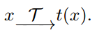
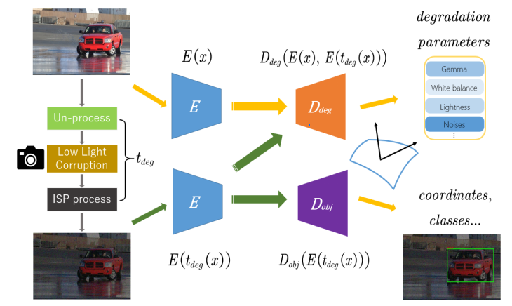
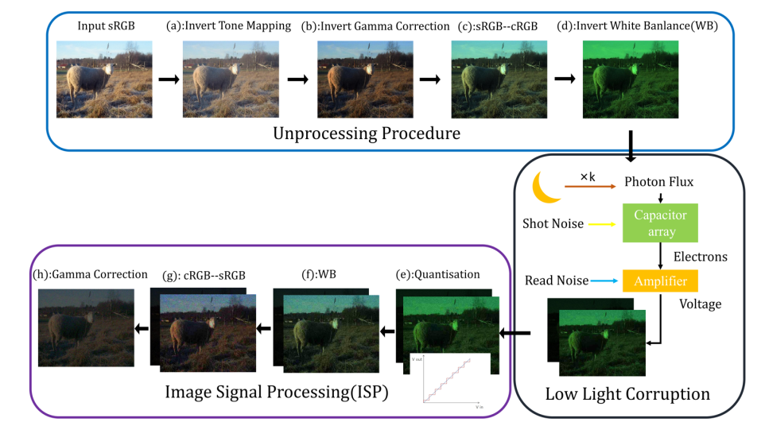
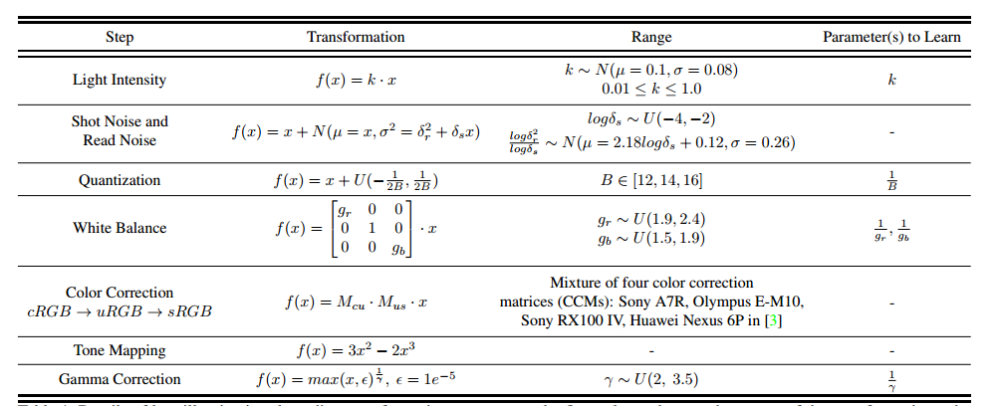
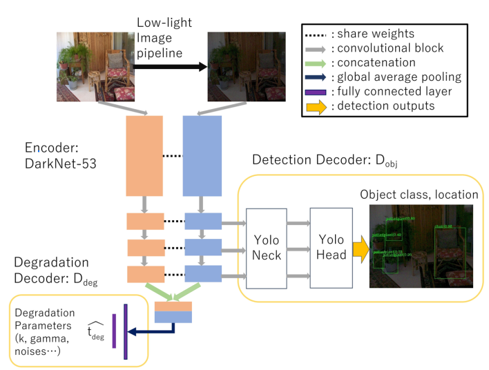
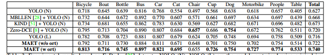
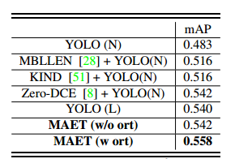

#### 用于暗目标检测的正交正切多任务AET

<!-- more -->

#### 问题

暗光场景场景下的高级视觉任务，比如检测分割分类这种，往往受限于三个显著的缺点：

1、环境中的光子数量很少，而且相机中的in-camra noise很大。

2、图像增强/恢复方法是针对人类视觉感知进行优化的，评价指标是PSNR和SSIM（人类视觉），而高级视觉任务的评价指标是mAP和IOU（机器视觉），评价指标具有不一致性，增强/恢复的图像不一定有利于高级视觉理解任务。

3、暗光场景下的数据集很少。

预训练的目标检测模型通常是在清晰和正常照明的图像上训练的。为了适应恶劣的光照条件，他们依靠增强的暗图像来微调模型，而不探索**当光照条件发送变化时，物体或场景本身所固有的、不变的结构特性**。即使有现有的数据集，**现实世界条件的不同分布也很难被训练集覆盖。**

#### AET

AET学习一些有代表性的潜在特征，这些特征可以从原始图像（x）和其经过变换t后的对应图像（t（x）中，解码或恢复出该参数化变换：

比如我们想要把手机里面的一张原图选择一个滤镜t，得到一个效果图t(x)，而这个滤镜t实际上是由一堆具体参数组成的，比如(亮度:-10，对比度:+20，饱和度:-30)，这组数字就是它的参数。

**AET模型通过对比原图和修改后的图，在内部学习并提炼出一些关键的、有代表性的信息（也就是“潜在特征”），然后利用这些学到的信息，准确地反推出来，你当初用的那个滤镜，它的具体参数。**

具体来说，AET包括siamese 表征编码器E和变换解码器D，编码器E从x及其变换t(x)中提取特征，这些特征应该捕获内在视觉结构来解释变换t。然后解码器D使用编码的E(x)和E(t(x))来解码t的估计：

$$ \widehat { t } = D _ { \phi } \left[ E ( x ) , E ( t ( x ) ) \right] .$$

通过最小化原始变换$$t$$和预测结果$$\widehat { t }$$的偏差损失**（预测变换$$t$$和ground truth变换$$\widehat { t }$$之间的均方误差（MSE）损失）**来训练：

$$ L _ { a e t } = \sum _ { k } l _ { k } ( \widehat { t } _ { k } , t _ { k } ) ,$$

#### 模型：

传统的分步走：先进行图像增强/恢复，再进行目标检测。但是**这样模型没有从根本上理解光照变化的原理**。在本文中，作者探索了一种集成的的框架来解决上面的问题。在这个统一的框架中，采用传统相机图像信号处理(image signal processor，ISP)的方法，把大规模数据集(如COCO)上面的正常图像转化为暗光图像，**模型会学习一张正常图片是如何“变”成一张低光、有噪声的图片的。它学习的是变化的内在规律（比如噪声水平、伽马校正、白平衡等参数）**。在理解了上述退化过程的基础上，模型直接在原始的低光图像中检测物体。

模型由两部分组成：表征编码器E和多任务解码器。

#### Low-Illumination Degrading Transformations

目标是设计一个光照退化转换$$ t _ { d e g }$$，通过减少光线将一个正常光照的无噪声图像x转换成与在弱光条件下拍摄的真实照片相匹配的暗图像$$ t _ { d e g } ( x )$$。

而现有的方法：反转伽马校正、基于retinex理论的合成等，完全没有考虑真实相机在黑暗中拍照时，其内部传感器和ISP到底发生了什么复杂的过程。

---------------------------------------------------------------------------------------

##### 1. 简化的方法（比如“反转伽马校正”）

这相当于一个**极其简陋的“山寨工厂”**。它的流程是：

1. 拿来一张已经生产好的、光鲜亮丽的成品（正常亮度的照片）。
2. 用一个简单的工具（比如一个调光旋钮，即伽马校正）把成品的亮度调低。
3. 再随便撒上一些“灰尘”（加一点高斯噪声），让它看起来旧一点。

**这种方法的问题在哪里？** 它完全是在对“成品”进行表面处理。它根本不知道一个产品从“原材料”开始，在真实的、恶劣的（黑暗）生产环境下，会经历哪些复杂的工序，会产生哪些独特的、无法避免的瑕疵。

##### 2. 真实相机的工作流程（物理传感器 + ISP流水线）

这才是**正规的、精密的“相机工厂”**。在黑暗环境下，它的流水线是这样的：

- **原材料采集：传感器物理 (Physics of Sensors)**
  - **信号微弱，噪声巨大**：在黑暗中，光子（光的最小单位）非常少。传感器接收到的有效“信号”极其微弱，但传感器自身固有的电子“噪声”（就像没台的电视雪花点）却相对很强。
  - **噪声成分复杂**：这种噪声不是简单的“灰尘”。它包括多种类型，比如由光子随机性产生的“散粒噪声”，由电路发热产生的“热噪声”，它们在图像中的分布和颜色都不均匀，非常独特。
- **产品加工：片上图像信号处理 (ISP - Image Signal Processing)**
  - ISP是相机内部的“**首席处理大师**”，它负责把传感器采集到的、充满噪声的原始数据，加工成我们最终看到的JPG或PNG照片。
  - 它的加工步骤非常复杂，包括但不限于：去马赛克、**去噪**、白平衡、色彩校正、**色调映射（Gamma校正只是其中一步）**、锐化等等。
  - **关键点**：ISP的每一步操作都是**高度非线性**且相互关联的。例如，它在处理一个像素时，会参考周围像素的亮度；它对噪声的处理方式，在图像的亮部和暗部是完全不同的。

---------------------------------------------------------------------------------------

所以这些简单地合成方法，完全没有考虑上述传感器噪声的复杂性和ISP的非线性处理，合成的暗光图像，其噪声模式、色彩偏移、细节丢失的方式，和真实相机拍出的暗光图像完全不一样。所以导致模型对于真实世界带有更加复杂特征的暗光图像时，泛化能力很差。**所以作者认为，要想让模型真正学会在黑暗中识别物体，不能简单地去骗模型，必须模拟整个真实相机的物理和处理流程，制造出更加真实的训练数据。**

**说白了就是合成图像考虑的还是太少了。**

#### 图像信号处理（ISP）方法

**相机传感器捕获的RAW数据在成为最终照片之前需要ISP**。

作者采用了简化的ISP及其取消处理过程。忽略了包括去马赛克过程在内的几个步骤。并在补充材料中对去马赛克的影响进行了详细的分析。

##### 量化：

使用模数转换器（ADC）将模拟信号x量化为离散信号$$ y _ { q u a n }$$。**量化步骤将一系列模拟电压映射为单个值，并产生均匀分布的量化噪声**。

---------------------------------------------------------------------------------------

模拟信号本来是连续的，可以有无限多位小数，但是我们量化必须将其量化为整数，在这个四舍五入的过程中，出现了误差，即量化噪声。因为在量化过程中，原始的模拟信号值是随机的，所以产生的这个误差大小也是随机的，它等概率地分布在两个离散刻度之间的任何位置。

比如说量化身高，对于任何一个被记录为 `175` 厘米的人，他的真实身高在 [174.5, 175.5)区间内。那么，他产生的误差就在 [-0.5, +0.5) 这个区间内。如果我们测量了成千上万个身高各不相同的人，那么这些人的身高小数部分是随机的。因此，他们产生的量化误差，落在 [-0.5, +0.5)区间内任何一个点的**概率是完全相等**的。误差是-0.4 的可能性，和误差是 +0.1 或+0.35 的可能性，是一样大的。误差不会倾向于都靠近0，也不会都倾向于靠近-0.5或+0.5。均匀分布就是这种，“在某个区间内，所有可能值的出现概率都完全相等”的概率分布。

**相机用模数转换器（ADC）把每个像素接收到的连续的光强（模拟电压），转换成一个离散的数字（比如0-255）。这个转换过程就必然会产生这种均匀分布的量化噪声。**

---------------------------------------------------------------------------------------

为了模拟量化步骤，添加了均匀分布（均匀分布的区间大小从12、14和16位中随机选择）的量化噪声$$ x _ { q u a n }$$。

$$ x _ { q u a n } \sim U ( - \frac { 1 } { 2 B } , \frac { 1 } { 2 B } )$$

$$ y _ { q u a n } = x + x _ { q u a n } .$$

##### 白平衡

人眼很智能，如果你拿着一张白纸，在**户外阳光下**看，它是白色的。如果你走进了一间只开了**黄色台灯**的屋子，再看这张纸，虽然他被黄光照着，但是你的大脑会自动“过滤”掉黄光，**仍然会感觉**它是白色的。这就是人眼的**色彩恒常性**。

但是相机传感器只记录它实际接收到的光，**相机拍到的图像=光源的颜色×物体表面的反射率**，所以如果你用关闭白平衡的相机去拍这张被黄光照着的纸，照片里的纸就是**黄色**的。

所以**白平衡就是相机模仿人眼色彩恒常性，修正这个问题**的过程，相机估计当前的光源颜色，然后反向操作，把照片里多余的颜色去掉，或者补上不足的颜色，**（即调整相应的颜色增益）**让“纸”在那个照片里也变回白色。**通过调整增益（gain）来“补上”或“减弱”某个颜色通道，来抵消掉“非中性”光线造成的色彩偏差，消除不真实的环境光色偏，还原物体本来的色彩。**（“中性”照明指的就是**不带任何颜色偏向的、纯白色的光**。）

$$ \begin{bmatrix} y _ { r } \\ y _ { g } \\ y _ { b } \end{bmatrix} = \begin{bmatrix} g _ { r } \quad 0 \quad 0 \\ 0 \quad 1 \quad 0 \\ 0 \quad 0 \quad g _ { b } \end{bmatrix} . \begin{bmatrix} x _ { r } \\ x _ { g } \\ x _ { b } \end{bmatrix}$$、

把绿色通道作为基准，所以乘以1，保持不变。把红色通道乘以一个增益系数$$ g _ { r }$$，把蓝色通道乘以一个增益系数$$ g _ { b } $$。

注意一点，作者这里说$$ g _ { r }$$从（1.9,2.4）中随机选择，$$ g _ { b } $$从（1.5,1.9）中随机选择；两者都遵循均匀分布，相互独立。逆过程考虑红色和蓝色增益的倒数1/g。

所以可见作者的目标**不是修正图片**，而是**人工制造出有色偏的照片**来训练模型，拿一张**色彩正常**的照片作为输入$$( x )$$，然后故意用一个**错误的“配方”去处理它，得到一张色彩很奇怪**的输出图片$$(y) $$,他随机选择一个**很大**的红色增益$$ g _ { r }$$（在1.9到2.4之间），这会让照片**严重偏红**。同时，他随机选择一个**也很大**的蓝色增益$$ g _ { b } $$（在1.5到1.9之间），这会让照片**严重偏蓝**。

通过随机选择这些参数，他可以生成**大量、各种各样**偏红、偏蓝、偏紫的“坏照片”。这些照片在色彩分布上更接近真实世界中因为光照不好而拍出的照片。**模型就能学会处理真实世界里各种复杂的色偏问题。**

##### 色彩空间变换

因为相机内部颜色空间cRGB与sRGB空间不相同，所以需要这一步来将白平衡信号从相机内部颜色空间转换为sRGB颜色空间，转换后的信号$$ y _ { s R G B }$$可以通过3×3颜色校准矩阵（CCM）$$ M _ { c c m }$$获得：

$$ y _ { s R G B } = M _ { c c m } \cdot y _ { c R G B } ,$$

这个过程的反转是：

$$ y _ { C R G B } = M _ { c c m } ^ { - 1 } \cdot y _ { s R G B } .$$

##### 伽马校正

人眼对亮度的感知不是线性的，我们对**暗部**的细节变化**更敏感**。

例如一个漆黑的房间，里面一盏灯都没有（亮度为0）。现在，点亮**1盏**灯。你会感觉**“哇，突然亮了很多！”** 这个变化非常明显。

但如果一个已经有**100盏**灯的明亮房间。这时，再多点亮**1盏**灯（变成101盏）。你几乎**感觉不到任何变化**。

所以这就是**感知的非线性**，明明都是增加了一盏灯的物理亮度，但是主观感受却完全不同。**我们的视觉系统在黑暗区域有更高的敏感度。**

由于我们对暗部细节更敏感，相机和显示器就需要投入更多的“资源”去记录和显示暗部的细节。

- **存储图像时（编码）**：相机会进行伽马校正，使用一个类似 $$ y = x ^ { 1 / \gamma }$$的曲线，人为地**提亮**图像的中间调和暗部。这样做的好处是，可以在有限的数据空间里（比如8-bit的JPG，只有256个亮度级别），把更多的级别**分配给暗部区域**，从而更精细地记录下我们人眼最关心的那部分信息。
- **显示图像时（解码）**：显示器会进行一次**反向的**伽马校正，使用类似 $$ y = x ^ { \gamma }$$的曲线，把图像**压暗**回它本来的样子。

**在本文中**，作者的目的是**模拟**一张“坏”照片，所以他直接在一个正常的图像上使用了**反向伽马校正**的公式（$$ y = x ^ { \gamma }$$），其中 $$\gamma$$是一个大于1的数（2到3.5）。这会**极大地压暗图像的暗部和中间调**，模拟出在黑暗环境中拍照时，细节大量丢失在阴影中的效果。

标准伽马曲线

$$ y _ { g a m m a } = m a x ( x , \epsilon ) ^ { \frac { 1 } { \gamma } }$$

反向是：

$$ y _ { i n v e r t g a m m a } = m a x ( x , \epsilon ) ^ { \gamma } .$$

伽马曲线参数$$\gamma $$可以从均匀分布$$ \gamma \sim U ( 2 , 3 . 5 )$$中随机采样，并且$$\gamma $$是一个非常小的值（$$ \epsilon = 1 e ^ { - 5 }$$），以防止训练期间的数值不稳定性。

##### 色调映射

目标是匹配胶片的特征曲线，意思是数字图像处理借鉴了**传统胶片**的“S”形色彩响应曲线，来让数码照片看起来更“好看”，更有“质感”。

---------------------------------------------------------------------------------------

##### 但是什么是胶片的特征曲线呢？

如果你把“光的强度（曝光量）”作为横轴，“胶片最终的密度（黑度）”作为纵轴，你会得到一条**“S”形**的曲线。这就是**胶片的特征曲线 (characteristic curve)**。

这条“S”曲线的特点是：

- **脚趾区 (Toe)**：在非常暗的区域，曲线很平。这意味着即使光线有一点变化，胶片的黑度也几乎不变。效果是**暗部细节被压缩，对比度较低**。
- **中间直线区 (Straight-line)**：在中间亮度区域，曲线很陡。光线变化一点点，黑度就会变化很多。效果是**中间调对比度很高，画面通透**。
- **肩膀区 (Shoulder)**：在非常亮的区域，曲线又变平了。光线再怎么增加，胶片也只会变得稍微黑一点点（对于负片而言）。效果是**亮部细节被压缩，高光过渡柔和，不容易“死白”一片**。

这条S曲线让胶片照片看起来对比分明，同时亮部和暗部的过渡又很自然，非常符合人类的审美。

##### 什么是色调映射？

数码相机的传感器记录光线是**线性**的（光强翻倍，记录的数值就翻倍），这会导致原始图像看起来很“平”，很“灰”，不好看。

**色调映射 (Tone Mapping)** 就是一个处理步骤，它人为地把传感器记录的线性数据，通过一个**“S”形**的数学函数（例如作者使用的smoothstep曲线），**强行“掰弯”成类似胶片的效果**。

**所以，这里的意思就是：** **色调映射这个数字处理技术，是在模仿和重现传统胶片那种经典的、美观的“S”形光影响应方式，从而让平淡的数字图像，也能拥有像胶片一样的高对比度和柔和的高光/阴影过渡。**

--------------------------------------------------------------------------------------

为了计算复杂度，作者执行“smoothstep”曲线

$$ y _ { t o n e } = 3 x ^ { 2 } - 2 x ^ { 3 }$$

反向逆操作

$$ y _ { i n v e r t  t o n e } = \frac { 1 } { 2 } - \sin ( \frac { \sin ^ { - 1 } ( 1 - 2 x ) } { 3 } ) .$$

####  Degrading Transformation Model

上面介绍了ISP方法的每个步骤，作者的low illumination degradation transform $$ t _ { d e g }$$，用正常光照图像$$x$$合成逼真的暗光图像$$ t _ { d e g } (x)$$。

因为黑暗环境、光线不足造成的物理损伤，是发生在相机最前端RAW数据阶段，而不是在最终的JPG/PNG图像阶段。

所以作者为了模拟这个过程，必须：

**第一步【反向，Unprocessing】**：先把一张正常光照的图像x，通过逆向处理过程，**还原**回它在相机里最初始的、未经任何加工的传感器测量或者RAW数据。

**第二步【施加损伤，Corruption】**：线性衰减RAW图像，在RAW图像这个最根本的层面上，模拟光线不足时发生的**物理现象**（比如信号弱、电子噪声大）。

**第三步【正向，ISP】**：把这张已经被“污染”了的RAW数据，再走一遍**正常的相机内部处理流程**，最终“冲洗”成一张看起来很真实的、又暗又多噪点的“成品照片$$ t _ { d e g } ( x ) $$”。

想象一下，我们的目标是**用电脑特效制作一个“被水泡过的、字迹模糊的旧信封”**。

- **我们的起点**：一张崭新的、字迹清晰的信封图片 (Input sRGB)。
- **错误的做法**：直接在清晰的信封图片上加一个“模糊滤镜”。这样做出来的效果会很假，一看就是电脑做的。
- **作者高明、逼真的做法（也就是图中的流程）**：
  1. **【反向步骤 a-d】**：首先，作者分析这个信封，“嗯，这个字是用某种墨水写的，这张纸是某种材质”。他用软件把清晰的字迹和干净的纸张，**还原**成最原始的“**未干的墨水**”和“**纯净的纸浆**”状态。这个“还原”过程，就相当于图中的 **Unprocessing Procedure**。所以(d)图看起来是怪怪的绿色，因为它是在模拟相机传感器最原始的RAW数据（在色彩校正前，RAW数据因为传感器排列的原因，绿色信息通常是其他颜色的两倍）。
  2. **【施加损伤步骤】**：现在，在“未干的墨水”和“纯净的纸浆”这个最根本的原材料层面，作者开始**模拟“被水泡”这个物理过程**。他模拟水滴滴下，导致墨水开始扩散、纸浆纤维开始膨胀。这个过程，就相当于图中的 **Low Light Corruption**。
  3. **【正向步骤 e-h】**：墨水和纸浆被“损坏”后，作者再**模拟“信封自然晾干”**的过程。墨水在纸上干涸后，会形成独特的、不均匀的模糊边缘。这个“重新晾干成型”的过程，就相当于图中的 **Image Signal Processing (ISP)**。

最终，我们得到了一张看起来**极其逼真**的、被水泡过的旧信封。

##### 逆向处理过程：

**通过（a）反转色调映射、（b）反转伽马校正、（c）图像从sRGB空间到cRGB空间的转换和（d）反转白平衡将输入的正常光照图像转换成与其捕获的光子成线性比例的逼真的RAW格式图像**。这些步骤统称为$$ t _ { u n p r o c e s s } \cdot$$

---------------------------------------------------------------------------------------

解释一下这里的RAW数据格式。

我们可以把相机传感器的每一个像素想象成一个用来接雨水的**小水桶**。

- **光子 (Photons)**：就是天空中落下的**雨滴**。
- **曝光时间**：就是你把水桶放在外面接雨水的**时长**。
- **RAW数据**：就是曝光结束后，你对桶里**水的高度（或水量）\**进行的\**原始、精确的测量读数**。

那么：

- 如果场景亮度为**X**（比如每秒落下1000个雨滴），曝光1秒后，桶里水的高度是**10毫米**。
- 如果场景亮度变为**2X**（每秒落下2000个雨滴），同样曝光1秒后，桶里水的高度不多不少，正好是**20毫米**。
- 如果场景亮度变为**10X**，水的高度就是**100毫米**。

所以说RAW数据和光子数量成**线性比例**，**它不加修饰地记录了这个物理世界的原始光照强度。**

因为作者是要在图像上模拟**真实的物理过程**（比如低光照下的各种噪声），**物理噪声**（如散粒噪声）的强度，是和**光子数量**直接相关的。因此，必须在与光子数量成**线性关系**的RAW数据上添加这些噪声，模拟出来的结果才是**物理上正确**的、**逼真的**。

否则直接在经过处理的RGB图像上添加物理噪声，是不符合真实世界规律的。

---------------------------------------------------------------------------------------

##### “Low Light Corruption”

当光子通过镜头投射到传感器像素上时，在相同的曝光、光圈和增益设置下，**每个像素产生的电荷量与环境的实际光照强度是相对应的。**

**散粒噪声 (Shot noise)是一种由光子本身抵达传感器的随机性所产生的噪声**，是物理原理上无法避免的根本限制。由于光子的抵达时间符合泊松统计规律，因此这种噪声的强度$$ ( \delta _ { s } )$$等于信号强度 $$ ( S )$$的平方根，即$$ \delta _ { s } = \sqrt { S }$$。**简单说，信号越强（光线越亮），这种噪声的绝对值也越大。**

**读出噪声 (Read noise)** 发生在**相机内部电路将像素收集到的电荷转换为电压信号的过程中**。它通常可以用一个均值为零、方差固定的高斯随机变量来近似模拟。这种噪声的强度与信号本身强弱无关。

散粒噪声和读出噪声在相机成像系统中普遍存在。因此，我们把传感器上测量到的总噪声$$ x _ { n o i s e }$$建模为一个正态分布（高斯分布）。这个高斯分布的**均值**$$ \mu$$就是信号的真实强度$$kx$$。**方差**$$ \sigma ^ { 2 }$$是读出噪声的方差$$ \delta _ { r } ^ { 2 }$$与散粒噪声的方差$$ \delta _ { s } k x$$两者之和。

$$ x _ { n o i s e } \sim N ( \mu = k x , \sigma ^ { 2 } = \delta _ { r } ^ { 2 } + \delta _ { s } k x )$$

$$ y _ { n o i s e } = k x + x _ { n o i s e } ,$$

x是我们通过“逆向处理”得到的每个像素的真实光照强度值。我们用参数k来线性地减弱信号强度，以此模拟不同的光照条件。为了模拟各种不同的黑暗场景，光照强度参数k是从一个特定的截断高斯分布中随机选取的，取值范围在0.01到1.0之间。读出噪声和散粒噪声的相关参数$$ \delta _ { r }$$ 和$$ \delta _ { s }$$的取值范围如表中所示。

**最终，相机记录到的带噪声的信号$$ y _ { n o i s e }$$，就是原始的真实信号$$ k x$$加上总噪声$$x_{noise}$$。**

这个模块其实就是我们比喻中的**核心物理模拟——“被水泡”**的步骤。它专门模拟光线不足时，相机传感器上发生的真实物理现象：

- **Photon Flux（光子通量）**：用月亮图标表示。这里的 `×k` 意味着作者把正常照片的光子数量乘以一个很小的系数k，以此来**模拟“黑暗”**（即进入相机的光非常少）。
- **Shot Noise（散粒噪声）**：光子本身到达传感器就是随机的。光线越弱，这种随机性就越明显，形成“散粒噪声”。这是**光的物理本质**带来的噪声。
- **Capacitor array（电容阵列）/Electrons**：代表传感器的像素，它把接收到的光子转换成**电子**（电荷）。
- **Read Noise（读出噪声）/Amplifier（放大器）**：光线太弱，产生的电子就很少。相机必须用**放大器**把这个微弱的信号放大。但放大器本身就像一个有杂音的话筒，它在放大信号的同时，也会引入自身的电子噪声，这就是**“读出噪声”**。

**“Low Light Corruption”这个模块，就是在数字底片上，通过“减少光子”来模拟黑暗，同时加上“散粒噪声”和“读出噪声”这两种最主要的物理噪声，从而完美复现了传感器在黑暗环境下的真实工作状态。**

##### ISP方法：

**通过（e）添加量化噪声（f）白平衡，（g）从cRGB到sRGB，以及（h）伽马校正将RAW图像转换为RGB图像**，其中（f）、（g）、（h）一起称为$$ t _ { I S P }$$。

最后，我们可以从正常光照图像x中获得弱光图像$$ t _ { d e g } ( x )$$：

$$ t _ { d e g } ( x ) = t _ { I S P } ( k \cdot t _ { u n p r o c e s s } ( x ) + x _ { n o i s e } + x _ { q u a n } ) .$$

#### 具有多任务AET的正交正则性

使用解码器$$ D _ { d e g }$$来解码 光照退化变换任务$$ t _ { d e g }$$的变换参数。使用解码器$$ D _ { o b j }$$来实现目标检测任务。直接从光照退化的图像中预测边界框位置和目标类别。

虽然这两个任务都是从同一个编码器获取信息，但是它们的输出反映了输入图像不同的方面：$$ D _ { d e g }$$的光照条件和$$ D _ { o b j }$$的目标位置和类别，**我们不希望模型在内部产生错误的关联。比如我们不希望噪声大小和检测任务产生联系，模型不应该学成”噪声很大“是“猫”的一个特征，**如果模型把这两者混为一谈，它的泛化能力就会变差。当它看到一张清晰的猫的照片时，反而可能因为“没有噪声”这个特征而降低识别为猫的置信度。这就是“不必要的相互依赖”。

**这表明可以施加一种正交约束，来解除不同任务输出之间不必要的相互依赖。**作者在模型的损失函数中增加了一个“惩罚项”。这个惩罚项会计算“光照任务的特征”和“检测任务的特征”之间的相关性。如果这两个特征**不正交（也就是有相关性）**，惩罚项的值就会变大，从而导致总损失变大。为了让总损失尽可能小，模型在训练过程中就必须**主动地**去调整自己，想办法让这两个任务的内部特征表示变得**互相垂直（正交）**。通过“正交惩罚”，模型被迫学习两套**相互独立的知识**：一套专门用来理解光照环境，另一套专门用来检测目标。这两套知识在模型内部“井水不犯河水”，成功地被分离开来，这就是“解耦”。

**在本文中作者提出的MAET的正交目标是最小化余弦相似度的绝对值：**

$$ L _ { o r t } = \sum _ { k , l } | \cos \theta _ { k , l } | = \sum _ { k , l } \frac { | \left[ \frac { \partial E } { \partial D ^k _ { deg} } \right] ^ { T } \cdot \left[ \frac { \partial E } { \partial D^l _ {obj} } \right] | } { || \frac { \partial E } { \partial ^k _ {deg} } || \cdot|| \frac { \partial E } { \partial D^l _ {obj} } || }  ,$$

式中$$ \frac { \partial E } { \partial D _ { d e g } ^ { k } }$$和$$ \frac { \partial E } { \partial D _ { o b j } ^ { l } }$$分别是由编码器E沿亮度退化变换和目标检测任务的第k层和第l层输出坐标形成的表示流形的正切。换言之，这两个切线分别描绘了表征随着解码器输出$$ D _ { d e g } ^ { k }$$和$$ D _ { o b j } ^ { l }$$的变化而移动的方向。**（梯度）**

**最小化余弦相似度的绝对值将推动两个切线尽可能正交**。基于几何观点，这将解开两个任务的纠缠，**以便一个任务的预测坐标的变化将对另一个任务的坐标产生最小的影响。**其中正交方向是根据沿着编码器诱导流形的解码器切线定义的。

---------------------------------------------------------------------------------------

#### 感觉**表示流形**非常难懂：

**把“表示流形”想象成一个”山脉地形图“**

- 编码器E：一个聪明的“制图师”。你给它一张**输入图片**（比如一张昏暗的猫的照片），它就会在这张复杂的三维山脉地形图上，找到一个**独一无二的点**来表示这张图片。这个点包含了图片的所有浓缩信息。所有可能的图片对应的所有点，就构成了整个山脉的表面。这个山脉表面，就是**“表示流形 (Representation Manifold)”**。
- 解码器D：两个专业的“读图师”，它们看着制图师标出的那个点，来解读信息。
  - $$D_{deg}$$：光照分析师，它看着这个点，读出这个点的“天气信息”，比如亮度、噪声等。
  - $$D_{obj}$$：物体分析师，它看着同一个点，读出这个点的“地理信息”，比如这里有一只猫，坐标是什么。

**1、编码器E沿亮度退化变换和目标检测任务的第k层和第l层输出坐标形成的表示流形的正切**

想象一下，你正站在山脉地图上的某一个点。你想微调一下光照分析师$$D_{deg}$$的一个读数（比如，你想让“亮度”这个读数变得稍微大一点）。**为了实现这个微小的变化，你需要在这个山坡上朝着某个特定方向移动一小步。**

这个“让你能最快改变‘亮度’读数的方向”，就是一个**向量**，它紧贴着山坡表面。在几何学上，这个贴着曲面的方向向量，就叫做**“切线 (Tangent)”**。**（梯度）**

所以：

- **“亮度退化任务的切线”**：就是站在地图上的那个点，**为了改变“光照”读数，脚下应该朝哪个方向迈步**。

- **“目标检测任务的切线”**：就是站在同一个点，**为了改变“物体位置”读数，脚下应该朝哪个方向迈步**。

这个切线是通过数学中的偏导数$$ \frac { \partial E } { \partial D}$$计算出来的，它的意思就是“当解码器D的输出要变化时，编码器E的表示（山上的点）应该如何变化”。**(就是梯度)**

**2、为什么说“这两个切线分别描绘了表征随着解码器输出 $$ D _ { d e g } ^ { k }$$和$$ D _ { o b j } ^ { l }$$的变化而移动的方向”**

这其实是对第一个问题的重申和确认。正是因为“切线”的定义就是“为了让解码器的某个输出值变化，山坡上那个代表图像的点应该移动的方向”。因为这正是它的定义。**切线就是“变化的方向”的数学表达**。

**3、“最小化余弦相似度的绝对值将推动两个切线尽可能正交。基于几何观点，这将解开两个任务的纠缠，以便一个任务的预测坐标的变化将对另一个任务的坐标产生最小的影响”**

我们现在在山坡上的一个点，有两个方向：

- **方向A**：“改变光照”的方向（比如，沿着山坡**向上**走）。

- **方向B**：“改变物体位置”的方向（比如，沿着山坡**水平**走，即等高线方向）。

**“余弦相似度”**是用来衡量两个方向的夹角的。

- 如果两个方向完全相同，夹角为0°，余弦相似度为1。
- 如果两个方向完全相反，夹角为180°，余弦相似度为-1。
- 如果两个方向**互相垂直（正交）**，夹角为90°，余弦相似度为**0**。

**“最小化余弦相似度的绝对值”，就是要让这个值尽可能地等于0。这也就意味着，模型在训练时，被强迫着让方向A和方向B的夹角尽可能变成90度。**

**这有什么好处呢？** 想象一下，如果“向上走”（改变光照）和“水平走”（改变物体位置）这两个方向是完全垂直的。那么：

- 当你**向上**走时，你的**水平**位置完全不变。
- 当你**水平**走时，你的**高度**也完全不变。

这就实现了**“解耦 (disentangle)”**，“改变光照”这个操作，完全不会影响到“目标位置”的分析；反之亦然。一个任务的变化对另一个任务产生了**“最小的影响”**。

**4、“正交方向是根据沿着编码器诱导流形的解码器切线定义的。”**

- **“编码器诱导流形” (Encoder-induced manifold)**：就是我们那个由“制图师”E绘制的“山脉地形图”。
- **“解码器切线” (Decoder tangents)**：就是我们站在山坡上，为了改变“读图师”D的读数，而需要移动的那些“方向”（向上走、水平走等）。
- **整句话的意思**：我们实现“正交解耦”这个宏伟目标，具体采用的技术手段是：在**“山脉地形图”**上，找到那些由**“读图师”**定义的**“方向”**，然后强行让它们之间互相**垂直**。

这与其它一些方法形成了对比，别的方法可能是在最终的输出层面对结果进行正交，而本文的方法更加深入，直接在核心的“表示空间”（我们的山脉地图）的几何结构上进行操作，所以作者特意强调了这一点。

---------------------------------------------------------------------------------------

因此，本文的弱光目标检测的总损失由三部分组成：退化变换损失$$ L_ { d e g }$$、目标检测损失$$ L _ { o b j }$$和正交正则损失$$ L _ { o r t }$$。

$$ L _ { t o t a l } = L _ { o r t } + \omega _ { 1 } \cdot L _ { o b j } + \omega _ { 2 } \cdot L _ { d e g } .$$

在本文中，$$ L _ { o b j }$$是YOLOv3的损失函数，其中包括位置损失、分类损失和置信度损失。退化变换损失$$ L_ { d e g }$$是具有低照度退化变换$$ t _ { d e g }$$的AET损失，ω1和ω2是固定平衡超参数。

#### 模型架构：

基于两个任务训练MAET（**训练阶段**）：

**（1）通过解码变换得到的未标记数据来学习内在表示**

**（2）基于标记数据解码对象位置和类别。**

E采用共享权重的连体结构，编码器采用DarkNet-53网络作为backbone。

**解码器D分为降级变换解码器$$ D _ { d e g }$$和目标检测解码器。前者侧重于解码弱光降级变换$$ ( t _ { d e g } ) $$的参数。后者解码目标信息，即目标类别和位置。**

**将编码后的潜在特征$$ E ( x )$$和$$ E ( t _ { d e g } ( x ) )$$级联在一起，传递给解码器$$ D _ { d e g }$$，以估计相应的降级变换$$t _ { d e g } $$，例如噪声水平、伽马校正和白平衡增益。这种自我监督训练有助于MAET学习未标记的变换数据的与光照方差等效的内在视觉结构，目标检测解码器$$ D _ { o b j }$$仅解码来自弱光图像的表示$$ E ( t _ { d e g } ( x ) )$$，以预测目标检测的参数。**

**测试过程，直接将弱光图像馈送到MAET编码器的弱光路径中，以解码检测结果：目标类别和位置。**

#### 实验

##### 真实世界评估：

为了评估在真实场景中的性能，作者使用专门的黑暗数据集评估了训练的模型。该数据集包括7,363张低光图像，从极端黑暗的环境到具有12个对象类别的暮光。

此外，还用了UG2+DARK FACE弱光人脸检测数据集评估了MAET。

#### 总结：

三个创新点：

1、加入了ISP过程来探究黑暗环境对于图像的底层影响，符合真实世界规律。

2、通过解码转换得到的弱光图像来学习内在视觉结构（自监督学习）

3、正交正则性，防止目标检测任务和弱光变换任务过度纠缠。

##### 缺点

1、作者的整个方法论，其**基石**是他们能成功地把一张sRGB成品图“无损”地逆向还原回线性的RAW数据。

**这在现实中几乎是不可能的。** 图像信号处理（ISP）是一个**有损 (lossy)** 的过程。尤其是色调映射（S曲线）、量化（四舍五入）和色彩空间转换，这些步骤会**永久性地丢失信息**。作者的“逆向”操作最多只能得到一个“**伪RAW**”（pseudo-RAW）数据。如果这个“伪RAW”与真实的RAW数据相差甚远，那么作者后续基于“物理”添加的噪声模型，其施加的基础就是错的。这会从根本上动摇他们声称的“物理真实性”。

并且现实的ISP非常复杂，作者的简化过程与参数的选择是否正确，是否充足，是否符合真实世界，模型可能只是拟合了作者的模拟数据。

2、**“正交解耦”的必要性和合理性。**作者使用“正交约束”来**强行**让“污染特征”和“物体特征”完全独立。

这是一个非常强的“先验假设”。但这两个任务真的应该**完全独立**吗？在现实中，它们可能是**高度相关**的。例如，某种**特定的噪声模式**（污染特征）可能**强烈暗示**了图像中某个区域是**深度阴影**，这恰恰**有助于**模型判断那里“不可能有物体”（物体特征）。通过强行正交，作者可能**切断了**这种有用的“相关性”信息流，是否可能会阻止模型学习到这类“通过环境线索来辅助内容识别”的特殊关联？反而**限制了**模型性能的上限。作者声称它们之间的依赖是“不必要的”，但这可能是一个需要更多实验来验证的强假设，需要提供充足的实验（比如“有正交约束” vs “无正交约束”的对比）来证明这个设计的优越性。

3、该方法依赖于高质量的正常光照图像（如PASCAL VOC数据集）作为“原材料”来合成暗光数据。这意味着合成数据的多样性和复杂性，仍然受限于原始清晰数据集的场景覆盖范围。如果原始数据集中缺少某些特定场景（如夜间城市霓虹灯、洞穴等），那么合成的数据也自然无法覆盖这些场景，模型在这些真实场景下的表现可能依然未知。

##### 思考

模型两个解码器，一个解码图像的退化参数，另一个解码图像的目标类别和位置，这两个是并行的，那么模型解码得到的退化参数对于检测任务的解码如何起作用呢？我的意思是这如何让这个检测器泛化到弱光图像上呢？ 

**解码退化参数作为一个辅助任务 (Auxiliary Task)，在训练阶段“逼迫”共享的编码器（Encoder）学到对最终检测任务更有用的特征。这两个任务并不是简单地并行跑完就结束了，它们之间通过共享的编码器进行着至关重要的信息交互。**

普通的检测器，给他一张黑暗中猫的图像，他提取的是一些模糊的、有噪点的特征几何，很难检测到目标。

或者说通过大量的弱光图像的训练，检测到了物体，但是当真实世界的光线、噪声模式稍微一变化，模型就检测不出来了，也就是说模型过拟合到训练图像上了。

而本文的这个检测器，参数解码和检测任务共享一个encoder，解码参数的decoder需要的是多噪点、黑暗的环境特征，而解码目标的decoder需要的是清晰的目标特征，所以共享的编码器会被迫去将环境特征和内容特征分类开。

也就是说我输入了正常光照和变换的图像，然后编码器为了去解决解码参数的任务，它会学习弱光图像相对于正常光图像的噪声特征，相当于把这一层纱揭开，而解码目标类别的解码器就会学习到干净的目标特征**（或者说我们前面那篇文章看到的光照不变特征）**。

**编码器首先进行特征解耦**：当一张新的真实弱光图像输入时，编码器凭借其强大的能力，首先将图像信息分解为：“这是一只猫（内容）” + “这张图很暗、噪声很大（环境）”。

**物体解码器得到“净化”后的信息**：编码器传递给物体解码器的，是经过提纯的、尽可能排除了环境干扰的“猫”的本质特征。

**实现泛化**：正因为模型学会了**分离变化的环境、抓住不变的内容**，所以无论真实世界的弱光环境如何变化（噪点多一点、少一点，色偏红一点、蓝一点），模型都能识别出那个“万变不离其宗”的物体。**它不再依赖于特定的噪点或亮度模式来进行识别。**

退化参数解码任务的价值，不在于它本身输出的那些参数，而在于它在训练过程中对**共享编码器**施加的**约束和压力**。这种压力，**迫使编码器学会了解耦特征**，能够从复杂的、受环境严重污染的信号中，提取出物体的本质核心特征。

**也就是说经过训练之后 ，模型学到了内容特征（光照不变特征）**。**这使得它拥有了强大的泛化能力，能够从容应对真实世界中千变万化的低光照环境。**
